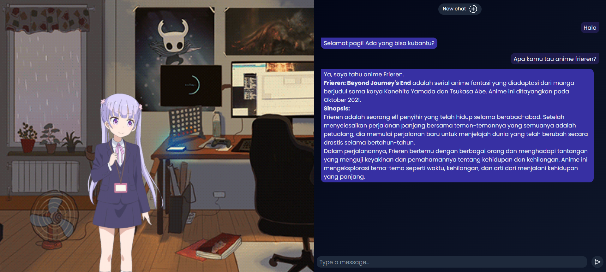

# Chat Aoba💌



Aoba is a 2D AI assistant powered by the powerful large language model Gemini. You can send messages to Aoba, and she will send back a reply.

> Shoutout to [Gemini](https://ai.google.dev/?gad_source=1&gclid=CjwKCAjwzN-vBhAkEiwAYiO7oApV59hAqoYYNV0PWBBJrKWeSOPAWTahrByXmc2M9lAZIFlz5pSVNhoCT-gQAvD_BwE) for the free LLM and [live2d](https://github.com/imuncle/live2d.git) for the Live2D display + model.
> Anything else is from the internet, and I do not claim any assets here, credits are to the rightful owner.

### Tools that used in this app

- React JS
- Express JS
- Vite
- Tailwind CSS
- daisyUI

## Installation

1. Clone this repository

```bash
  git clone https://github.com/reynaldomarchell/chat-aoba.git
```

2.  Go to the project directory and open VS Code

```bash
  cd chat-aoba
  code .
```

3. On server directory, change `.env.example` to `.env`, then fill in your API key

```bash
  # Input your Google Gemini API key here
  GEMINI_API_KEY =
```

4. Open new terminal on server directory, install the dependencies and run the server

```bash
  npm i
  npm run server
```

5. Open new terminal on client directory, install the dependencies and run the app

```bash
  npm i
  npm run dev
```

6. App will run on http://localhost:5173/
